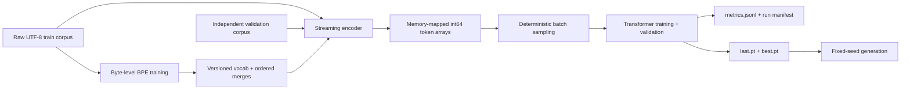

# LMForge

**A benchmark-driven, from-scratch lightweight LLM pretraining system.**

LMForge covers the complete path from raw UTF-8 text to a trained language
model: byte-level BPE, memory-mapped token data, a decoder-only Transformer,
deterministic training and resume, validation, checkpointing, and fixed-seed
generation. Performance claims are published only after output-parity checks
and reproducible measurements.

## Highlights

- **From-scratch core:** byte-level BPE, RoPE attention, RMSNorm, SwiGLU,
  cross-entropy, AdamW, gradient clipping, and cosine learning-rate scheduling.
- **Correctness first:** numerical snapshots, tokenizer parity, checkpoint
  round trips, deterministic resume, CLI integration, and repository hygiene;
  the current suite passes **129 tests** with 1 non-strict memory-test XPASS.
- **Measured tokenizer optimization:** on the reviewed 5 MiB benchmark, the
  optimized four-process trainer reduced median wall time by **71.66%** and
  median peak process-tree RSS by **55.43%**, while producing the same ordered
  vocabulary and merges.
- **End-to-end TinyStories result:** a 7.60M-parameter model trained for
  **10,000 steps / 81.92M tokens** reached **1.80896 best validation loss** on
  an RTX 3050 4 GiB.
- **Reproducible runs:** typed TOML configuration, content hashes, environment
  manifests, JSONL metrics, atomic checkpoints, and fixed-seed generation.

## Architecture



The production package is installed as `lmforge` from `src/lmforge`. A single
CLI owns configuration loading and dispatches to focused tokenizer, data,
training, evaluation, checkpoint, logging, and generation modules.

## Tokenizer

LMForge implements deterministic byte-level BPE with special-token handling,
lossless JSON/hex serialization, streaming encoding, and stable tokenizer
fingerprints. The optimized trainer represents repeated pre-tokens as unique
words plus frequencies, updates only words affected by a merge, and uses a
bounded lazy heap without changing merge semantics.

### Reviewed tokenizer benchmark

| Implementation | Median wall time | Median peak RAM | Correctness |
|---|---:|---:|---|
| Baseline, 1 process | 2.874 s | 127.30 MiB | Matching artifact hash |
| Optimized, 1 process | 1.045 s | 41.91 MiB | Matching artifact hash |
| Baseline, 4 processes | 2.684 s | 273.52 MiB | Matching artifact hash |
| Optimized, 4 processes | 0.761 s | 121.92 MiB | Matching artifact hash |

Protocol: TinyStories 5 MiB fixture (5,242,880 bytes), vocabulary size 1,000,
three independent child-process runs per cell, reported as the median. The
machine was WSL2 on an Intel Core i7-12700H with 20 logical CPUs and Python
3.12.13. Peak RAM is the maximum sampled sum of RSS for the root process and
all recursive child processes. All 12 runs produced the same 1,000-entry
vocabulary, 743 ordered merges, and artifact SHA-256.

Machine-readable evidence: [reports/bpe_5mb_wsl.json](reports/bpe_5mb_wsl.json).
The accompanying analysis is in
[reports/bpe_optimization_report.md](reports/bpe_optimization_report.md).

## Model

The current model is a decoder-only Transformer assembled from explicit,
readable components:

- learned token embeddings and a separate linear language-model head;
- causal multi-head self-attention with rotary positional embeddings;
- pre-normalized Transformer blocks using RMSNorm;
- SwiGLU feed-forward layers;
- explicit token-position propagation through every block;
- full-context autoregressive sampling with temperature and nucleus filtering.

Phase 1 intentionally uses the readable reference attention path. SDPA,
`torch.compile`, BF16 benchmarking, and optional FlashAttention are not claimed
as completed optimizations.

## Training system

- Memory-mapped one-dimensional `int64` token arrays keep dataset loading
  independent of corpus size.
- Separate seeded NumPy generators isolate training and validation sampling.
- Gradient accumulation, global-norm clipping, custom AdamW, and cosine decay
  are coordinated by one training engine.
- Validation runs in evaluation/no-grad mode without consuming the training
  sampler state.
- `cs336-training-v1` checkpoints include model, optimizer, scaler, iteration,
  tokenizer, data hashes, and Python/NumPy/PyTorch/CUDA RNG states.
- Checkpoints are written atomically; interrupted training resumes at the next
  optimizer step. A 30-step + resume-to-60 smoke run matched an uninterrupted
  60-step run bit-for-bit across every checkpoint field.
- Every formal run writes canonical configuration, raw JSONL metrics, and a
  manifest containing code, environment, hardware, data, tokenizer, and seed
  identity.

## Optimization methodology

Optimization begins with a correctness oracle, then profiling, a bounded
implementation change, output-parity tests, and finally isolated measurement.
For BPE training, cProfile and stage timers identified repeated corpus
materialization and pair initialization as the dominant costs. Replacing those
representations reduced pair initialization from roughly 1.8 seconds to 0.02
seconds in the reviewed benchmark while preserving the complete artifact.

Profiler-instrumented durations are not used as benchmark wall time. The
published tokenizer table uses independent non-profiled child processes.

**Training-systems optimization benchmark is planned for Phase 2.** There is no
published baseline/BF16/compile/SDPA training-performance table yet.

## TinyStories results

This is one formal, deterministic FP32 training run on the distinct TinyStories
V2 GPT-4 train and validation files. The tokenizer was trained only on the
training corpus.

| Item | Verified value |
|---|---|
| Model | vocab 8,192; context 256; width 256; 4 layers; 4 heads; FFN 768 |
| Parameters | 7,604,480 |
| Training budget | 10,000 optimizer steps; 81,920,000 effective tokens |
| Effective batch | 4 sequences × 8 accumulation = 32 sequences / 8,192 tokens per step |
| Precision and seed | FP32, seed 42, deterministic CUDA |
| Best validation loss | **1.8089607119560243 at step 9,500** (`best.pt`) |
| Final validation loss | **1.9673571467399598 at step 10,000** (`last.pt`) |
| Hardware | NVIDIA GeForce RTX 3050 Laptop GPU, 4 GiB |
| Run count | One formal training run; 100 sampled validation points |

The run completed without OOM, restart, configuration changes, or skipped
optimizer steps. Validation uses 10 sampled batches every 100 steps, so the
curve is noisy; the plot below is generated directly from the unsmoothed
`metrics.jsonl`.


Machine-readable result:
[assets/results/tinystories-phase1-result.json](assets/results/tinystories-phase1-result.json).

### Fixed-seed generation

Checkpoint `best.pt`; prompt `Once upon a time`; seed 123; temperature 0.8;
top-p 0.9; 128 new tokens. Two independent CUDA invocations were byte-identical.

> Once upon a time, there was a little girl named Sue. Sue loved to wear her
> favorite dress. She liked to wear pretty dresses and wear it all in her
> dress.
>
> One day, Sue found a big, shiny rock. She was so happy and wanted to show her
> mom. She put on her dress and went to play with her friends.
>
> When Sue saw her friend, Tom, the turtle, Tom, there was a tiny mouse named
> Jerry. Tom was playing with a ball. Tom said, "Hi, Jerry! Let's play!" They
> played together and had a lot of fun.
>
> After playing, Sue and Tom were tired.

Raw sample: [assets/results/tinystories-phase1-sample.txt](assets/results/tinystories-phase1-sample.txt).

## Reproduce

The commands below start from a clean checkout and use only repository-relative
paths. Python 3.12, `uv`, and a CUDA-capable PyTorch environment are expected.
The full tokenizer run is memory-intensive; the verified WSL host used one
worker and 16 GiB of swap.

### 1. Install and obtain TinyStories

```bash
git status --short  # expected: no output
uv sync --locked --dev

mkdir -p data
curl -L https://huggingface.co/datasets/roneneldan/TinyStories/resolve/main/TinyStoriesV2-GPT4-train.txt \
  -o data/TinyStoriesV2-GPT4-train.txt
curl -L https://huggingface.co/datasets/roneneldan/TinyStories/resolve/main/TinyStoriesV2-GPT4-valid.txt \
  -o data/TinyStoriesV2-GPT4-valid.txt

sha256sum data/TinyStoriesV2-GPT4-{train,valid}.txt
# train: 6418d412de72888f52b5142c761ac21a582f7d1166f0bfbdb5f03ccfdec90443
# valid: 6874bae9a4c1a4e7edcf0e53b86c17817e9cf881fc75ff2368da457b80c0585d
```

### 2. Train the tokenizer on the training corpus only

```bash
uv run python - <<'PY'
from lmforge.tokenization.serialization import save_tokenizer_files
from lmforge.tokenization.train_bpe import train_bpe

vocab, merges = train_bpe(
    "data/TinyStoriesV2-GPT4-train.txt",
    8192,
    ["<|endoftext|>"],
    num_processes=1,
)
save_tokenizer_files(
    vocab,
    merges,
    "artifacts/tinystories-p1/tokenizer/vocab.json",
    "artifacts/tinystories-p1/tokenizer/merges.json",
)
PY
```

### 3. Prepare separate token arrays

```bash
uv run lmforge prepare --config assets/configs/tinystories-phase1.toml
```

### 4. Smoke, resume, and formal training

```bash
# Lightweight two-step CLI check after data preparation.
CUBLAS_WORKSPACE_CONFIG=:4096:8 uv run lmforge train \
  --config assets/configs/tinystories-smoke.toml \
  --max-steps 2 \
  --output-dir artifacts/readme-smoke
CUBLAS_WORKSPACE_CONFIG=:4096:8 uv run lmforge generate \
  --checkpoint artifacts/readme-smoke/last.pt \
  --prompt 'Once upon a time' \
  --max-new-tokens 8 \
  --temperature 0.8 \
  --top-p 0.9 \
  --seed 123 \
  --device cuda

# Uninterrupted 60-step smoke run with validation and checkpoints.
CUBLAS_WORKSPACE_CONFIG=:4096:8 uv run lmforge train \
  --config assets/configs/tinystories-smoke.toml

# Independent interrupted/resumed smoke run: 30 -> 60 total steps.
CUBLAS_WORKSPACE_CONFIG=:4096:8 uv run lmforge train \
  --config assets/configs/tinystories-smoke.toml \
  --max-steps 30 \
  --output-dir artifacts/tinystories-p1/smoke/resumed
CUBLAS_WORKSPACE_CONFIG=:4096:8 uv run lmforge train \
  --config assets/configs/tinystories-smoke.toml \
  --max-steps 60 \
  --output-dir artifacts/tinystories-p1/smoke/resumed \
  --resume artifacts/tinystories-p1/smoke/resumed/last.pt

# Formal 10,000-step run.
CUBLAS_WORKSPACE_CONFIG=:4096:8 uv run lmforge train \
  --config assets/configs/tinystories-phase1.toml
```

### 5. Regenerate the curve and sample

```bash
uv run python scripts/plot_training.py \
  --metrics artifacts/tinystories-p1/formal/metrics.jsonl \
  --output artifacts/tinystories-p1/formal/loss.svg

CUBLAS_WORKSPACE_CONFIG=:4096:8 uv run lmforge generate \
  --checkpoint artifacts/tinystories-p1/formal/best.pt \
  --prompt 'Once upon a time' \
  --max-new-tokens 128 \
  --temperature 0.8 \
  --top-p 0.9 \
  --seed 123 \
  --device cuda
```

## Tests

```bash
uv run lmforge --help
PYTHONUTF8=1 uv run pytest -q
uv run python scripts/check_repository_hygiene.py
```

The current gate is **129 passed, 1 xpassed, 4 warnings**. CI also verifies a
locked CPU install, the installed CLI, scoped lint/format checks, and that no
datasets, checkpoints, run logs, or local collaboration files are tracked.

## Project status and roadmap

Phase 1 is complete: installable package, unified CLI, typed configuration,
focused training modules, reproducibility manifests, deterministic resume,
repository hygiene, and a verified TinyStories run.

Phase 2 is planned work: correctness-gated training-system benchmarks across
reference attention and SDPA, FP32 and BF16, eager and `torch.compile`, several
context lengths, synchronized timing, and peak GPU-memory reporting. Optional
FlashAttention and KV-cache inference remain later work and are not presented
as completed features.

## Acknowledgements

Initial implementation was inspired by Stanford CS336: Language Modeling from
Scratch.

LMForge incorporates code and tests derived from Stanford University's CS336
Spring 2025 Assignment 1. The original Stanford copyright and MIT license are
preserved in [LICENSE](LICENSE); detailed provenance is recorded in
[NOTICE](NOTICE). Stanford University does not endorse this derivative project.
