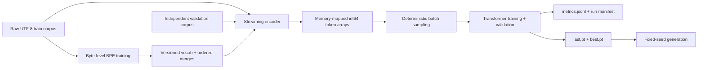
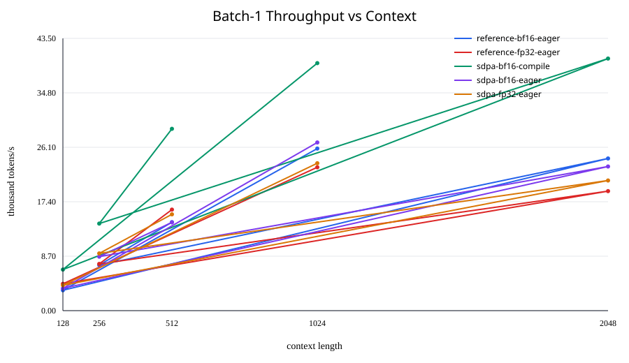
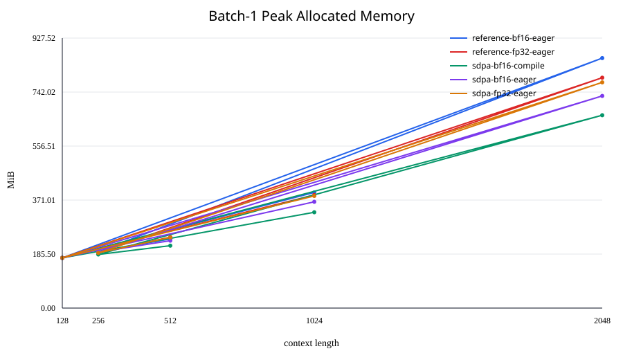
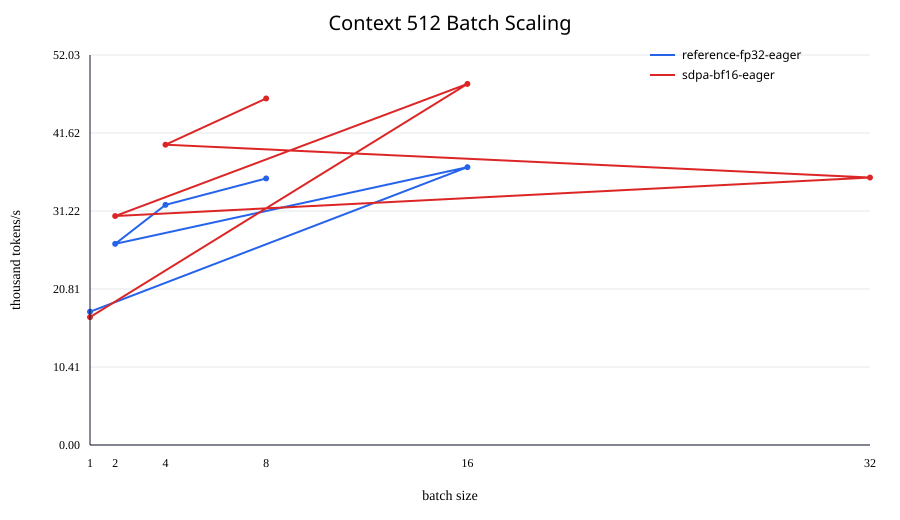
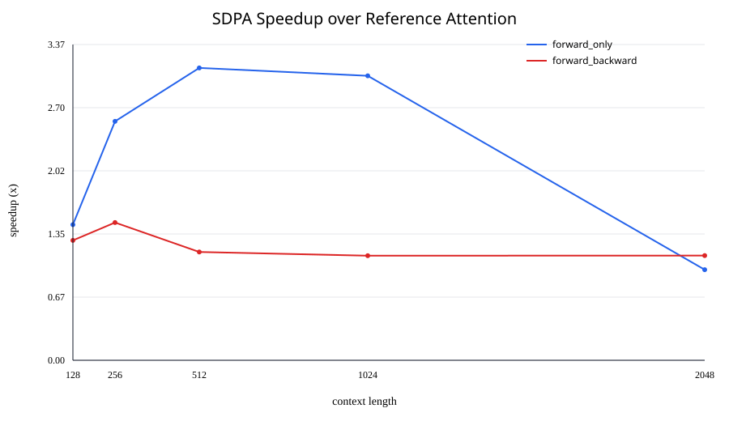
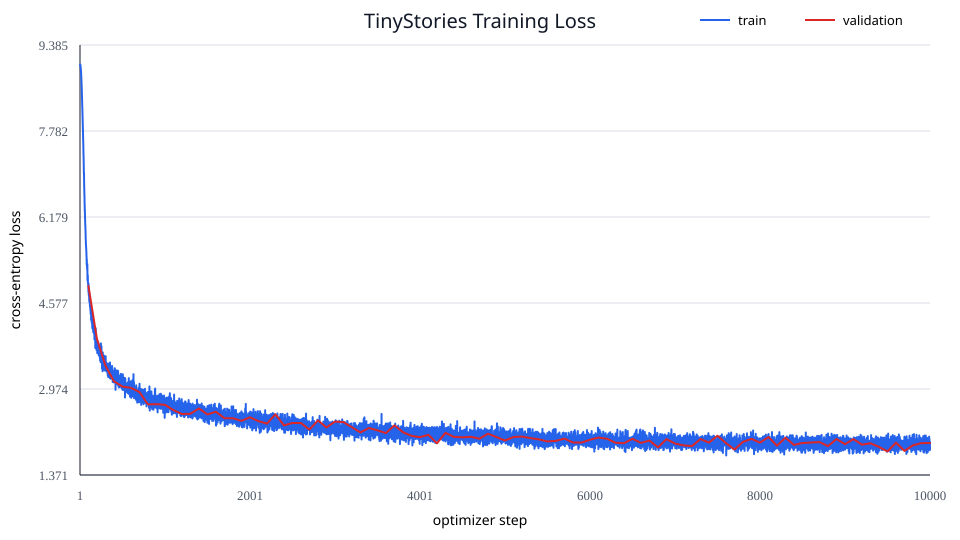

# LMForge

**A benchmark-driven, from-scratch lightweight LLM pretraining system.**

LMForge covers the complete path from raw UTF-8 text to a trained language
model: byte-level BPE, memory-mapped token data, a decoder-only Transformer,
deterministic training and resume, validation, checkpointing, and fixed-seed
generation. Performance claims are published only after output-parity checks
and reproducible measurements.

## Highlights

- **From-scratch core:** byte-level BPE, RoPE attention, RMSNorm, SwiGLU,
  cross-entropy, AdamW, gradient clipping, and cosine learning-rate scheduling.
- **Correctness first:** numerical snapshots, tokenizer parity, checkpoint
  round trips, deterministic resume, CLI integration, and repository hygiene;
  the complete CPU suite passes **166 tests**, with 4 CUDA skips and 1
  non-strict memory-test XPASS.
- **Measured tokenizer optimization:** on frozen 1 MiB corpus subsets, the
  production BPE trainer is **7.90x faster on TinyStories** and **13.73x faster
  on OpenWebText** than the full-rescan oracle, with identical vocabulary and
  ordered-merge hashes.
- **End-to-end TinyStories result:** a 7.60M-parameter model trained for
  **10,000 steps / 81.92M tokens** reached **1.80896 best validation loss** on
  an RTX 3050 4 GiB.
- **Reproducible runs:** typed TOML configuration, content hashes, environment
  manifests, JSONL metrics, atomic checkpoints, and fixed-seed generation.

## Architecture



The production package is installed as `lmforge` from `src/lmforge`. A single
CLI owns configuration loading and dispatches to focused tokenizer, data,
training, evaluation, checkpoint, logging, and generation modules.

## Tokenizer

LMForge implements deterministic byte-level BPE with special-token handling,
lossless JSON/hex serialization, streaming encoding, and stable tokenizer
fingerprints. The optimized trainer represents repeated pre-tokens as unique
words plus frequencies, updates only words affected by a merge, and uses a
bounded lazy heap without changing merge semantics.

### Reviewed tokenizer benchmark

| Deterministic 1 MiB subset | Naive full rescan | Production | Speedup | Peak RSS, naive to production | Correctness |
|---|---:|---:|---:|---:|---|
| TinyStories | 1.686 s | 0.213 s | 7.90x | 78.3 to 79.5 MiB (+1.5%) | Exact vocab + merges |
| OpenWebText | 9.183 s | 0.669 s | 13.73x | 91.8 to 102.9 MiB (+12.1%) | Exact vocab + merges |

Protocol: deterministic UTF-8-safe 1,048,576-byte prefixes, vocabulary size
384, one process, and three independent child-process runs per trainer and
dataset, reported as the median. Trainer order alternated by repetition. The
machine was WSL2 with 20 logical CPUs and Python 3.12.3. Peak RSS is the maximum
sampled RSS of the worker process tree. Every run passed encode/decode
round-trip and special-token gates; production and naive outputs had identical
vocabulary and ordered-merges hashes.

The result supports a training-time claim, not a memory-reduction claim:
production's maintained indexes consume more memory at this scale. Tiny fixture
timings are excluded because process/import overhead dominates them, and the
naive trainer was not run on complete OpenWebText.

Machine-readable evidence:
[reports/phase3/summary.json](reports/phase3/summary.json) and
[reports/phase3/tokenizer-comparison.csv](reports/phase3/tokenizer-comparison.csv).
The earlier 5 MiB implementation study remains available in
[reports/bpe_optimization_report.md](reports/bpe_optimization_report.md).

## Model

The current model is a decoder-only Transformer assembled from explicit,
readable components:

- learned token embeddings and a separate linear language-model head;
- causal multi-head self-attention with rotary positional embeddings;
- pre-normalized Transformer blocks using RMSNorm;
- SwiGLU feed-forward layers;
- explicit token-position propagation through every block;
- full-context autoregressive sampling with temperature and nucleus filtering.

The readable reference path remains the default. Phase 2 adds explicit SDPA,
BF16, and `torch.compile` execution policies without changing checkpoint tensor
shapes. Optional FlashAttention is not implemented or claimed.

## Training system

- Memory-mapped one-dimensional `int64` token arrays keep dataset loading
  independent of corpus size.
- Separate seeded NumPy generators isolate training and validation sampling.
- Gradient accumulation, global-norm clipping, custom AdamW, and cosine decay
  are coordinated by one training engine.
- Validation runs in evaluation/no-grad mode without consuming the training
  sampler state.
- `cs336-training-v1` checkpoints include model, optimizer, scaler, iteration,
  tokenizer, data hashes, and Python/NumPy/PyTorch/CUDA RNG states.
- Checkpoints are written atomically; interrupted training resumes at the next
  optimizer step. A 30-step + resume-to-60 smoke run matched an uninterrupted
  60-step run bit-for-bit across every checkpoint field.
- Every formal run writes canonical configuration, raw JSONL metrics, and a
  manifest containing code, environment, hardware, data, tokenizer, and seed
  identity.

## Optimization methodology

Optimization begins with a correctness oracle, then profiling, a bounded
implementation change, output-parity tests, and finally isolated measurement.
For BPE training, the frozen full-rescan profile attributes 58.51% of
instrumented trainer time to repeated pair recounting and 39.74% to repeated
whole-vocabulary merge scans. Production maintains pair counts and updates only
affected words; the independent benchmark above confirms that this removes the
dominant work while preserving the complete artifact.

Profiler-instrumented durations are not used as benchmark wall time. The
published tokenizer table uses independent non-profiled child processes.

### Reviewed Phase 2 training benchmark

The publication benchmark used commit `fd11e1c3930e1e554d4ce77c26ebfc0c3976ec1c`
on an NVIDIA GeForce RTX 3050 Laptop GPU (4 GiB), WSL2 Ubuntu 24.04,
PyTorch 2.6.0+cu124, CUDA 12.4, cuDNN 90100, and seed 42. Every table cell is
the mean of three independent runs; variation is the sample standard deviation
across run-level steady-state medians. Each microbenchmark used one cold step,
five warmup steps, and ten measured steps with CUDA synchronization. No best-run
selection is used.

The fixed-batch control matrix isolates context scaling. “Optimized” means
SDPA + BF16 autocast + compiled model execution; parameters, optimizer state,
loss, finite checks, clipping, and optimizer updates remain FP32.

| Context | FLOPs/step | Reference FP32 tokens/s | Optimized tokens/s | Speedup | Peak allocated, ref → opt | MFU, ref → opt |
|---:|---:|---:|---:|---:|---:|---:|
| 128 | 4.43G | 4,286 ± 449 | 6,565 ± 1,872 | 1.53× | 172.4 → 172.4 MiB | 2.08% → 0.80% |
| 256 | 9.26G | 7,467 ± 455 | 13,912 ± 2,027 | 1.86× | 190.0 → 184.1 MiB | 3.79% → 1.77% |
| 512 | 20.13G | 16,142 ± 1,688 | 29,052 ± 265 | 1.80× | 243.7 → 214.4 MiB | 8.91% → 4.01% |
| 1,024 | 46.71G | 22,909 ± 665 | 39,546 ± 1,380 | 1.73× | 388.4 → 329.1 MiB | 14.66% → 6.33% |
| 2,048 | 119.19G | 19,095 ± 229 | 40,276 ± 367 | 2.11× | 791.4 → 662.5 MiB | 15.59% → 8.22% |

Compile cold start averaged 64.19–68.86 seconds across contexts and is excluded
from steady-state throughput. Eager SDPA+BF16 is not uniformly faster: relative
to reference FP32 it measured 0.83× at context 128, 1.16× at 256, 0.87× at 512,
1.17× at 1,024, and 1.21× at 2,048. The negative points are retained.





The capacity scan repeated every successful batch and physical-memory boundary
three times. SDPA+BF16 doubled the largest valid tested batch only at context
512 (16 → 32); other power-of-two boundaries were unchanged. WSL unified
memory can spill beyond the discrete GPU, so 30 boundary rows are recorded as
`DeviceMemoryCapacityExceeded`, not hidden or described as native CUDA OOMs.

| Context | Reference max batch / tokens/s | SDPA+BF16 max batch / tokens/s |
|---:|---:|---:|
| 128 | 128 / 33,022 ± 7 | 128 / 41,596 ± 52 |
| 256 | 64 / 31,505 ± 3 | 64 / 39,581 ± 41 |
| 512 | 16 / 37,066 ± 17 | 32 / 35,681 ± 38 |
| 1,024 | 8 / 30,181 ± 37 | 8 / 38,395 ± 184 |
| 2,048 | 4 / 21,106 ± 15 | 4 / 25,939 ± 59 |



The attention-only comparison confirms the profiler hypothesis but also shows
that kernel choice is workload-dependent. SDPA forward+backward speedup ranged
from 1.12× to 1.47×. Forward-only speedup rose to 3.12× at context 512, while
the batch-1/context-2,048 point was a 0.97× negative result.



Finally, both end-to-end configurations trained from scratch for 1,000
optimizer steps on the frozen TinyStories train/validation arrays, three times
each, with deterministic CUDA and identical seed/data sampling.

| Configuration | FLOPs/step | Steady tokens/s | Step time | MFU | Cold first step | Final validation loss |
|---|---:|---:|---:|---:|---:|---:|
| Reference FP32 eager | 296.35G | 29,534 ± 251 | 277.88 ± 2.35 ms | 14.96% | 2.29 s | 2.679280 ± 0 |
| SDPA + BF16 + compile | 296.35G | 45,616 ± 482 | 180.04 ± 1.91 ms | 5.77% | 58.52 s | 2.679786 ± 0 |

The optimized long run is 1.54× faster after compilation; its final validation
loss differs by +0.000506. All six runs completed 1,000 steps with finite
losses and zero skipped optimizer steps.

#### FLOPs and MFU method

For batch `B`, context `T`, width `d`, FFN width `d_ff`, layers `L`, and
vocabulary `V`, the dense model FLOPs estimate per training step is:

```text
3 × [L × (8BTd² + 4BT²d + 6BTd·d_ff) + 2BTdV]
```

The factor three approximates forward plus backward matrix multiplication.
Embedding lookup, normalization, activation, softmax, loss, clipping, and
optimizer elementwise work are excluded, so MFU is a model-FLOPs estimate, not
whole-device utilization. `MFU = model FLOPs / step seconds / hardware peak`.

The FP32 denominator is 7.127 TFLOP/s: 2,048 CUDA cores × the official maximum
1.740 GHz boost × two FLOPs/FMA. The BF16 dense Tensor Core denominator is
28.508 TFLOP/s, using the documented dense GA10x BF16:FP32 peak ratio of 4:1;
sparsity is not assumed. The RTX 3050 Laptop core/clock range comes from
[NVIDIA's laptop specification](https://www.nvidia.com/en-gb/geforce/laptops/30-series/),
and the operation rates from the
[NVIDIA Ampere GA102 architecture whitepaper](https://www.nvidia.com/content/PDF/nvidia-ampere-ga-102-gpu-architecture-whitepaper-v2.1.pdf).
Raw run-level and aggregate data are in [reports/phase2](reports/phase2).

## TinyStories results

This is one formal, deterministic FP32 training run on the distinct TinyStories
V2 GPT-4 train and validation files. The tokenizer was trained only on the
training corpus.

| Item | Verified value |
|---|---|
| Model | vocab 8,192; context 256; width 256; 4 layers; 4 heads; FFN 768 |
| Parameters | 7,604,480 |
| Training budget | 10,000 optimizer steps; 81,920,000 effective tokens |
| Effective batch | 4 sequences × 8 accumulation = 32 sequences / 8,192 tokens per step |
| Precision and seed | FP32, seed 42, deterministic CUDA |
| Best validation loss | **1.8089607119560243 at step 9,500** (`best.pt`) |
| Final validation loss | **1.9673571467399598 at step 10,000** (`last.pt`) |
| Hardware | NVIDIA GeForce RTX 3050 Laptop GPU, 4 GiB |
| Run count | One formal training run; 100 sampled validation points |

The run completed without OOM, restart, configuration changes, or skipped
optimizer steps. Validation uses 10 sampled batches every 100 steps, so the
curve is noisy; the plot below is generated directly from the unsmoothed
`metrics.jsonl`.



Machine-readable result:
[assets/results/tinystories-phase1-result.json](assets/results/tinystories-phase1-result.json).

### Fixed-seed generation

Checkpoint `best.pt`; prompt `Once upon a time`; seed 123; temperature 0.8;
top-p 0.9; 128 new tokens. Two independent CUDA invocations were byte-identical.

> Once upon a time, there was a little girl named Sue. Sue loved to wear her
> favorite dress. She liked to wear pretty dresses and wear it all in her
> dress.
>
> One day, Sue found a big, shiny rock. She was so happy and wanted to show her
> mom. She put on her dress and went to play with her friends.
>
> When Sue saw her friend, Tom, the turtle, Tom, there was a tiny mouse named
> Jerry. Tom was playing with a ball. Tom said, "Hi, Jerry! Let's play!" They
> played together and had a lot of fun.
>
> After playing, Sue and Tom were tired.

Raw sample: [assets/results/tinystories-phase1-sample.txt](assets/results/tinystories-phase1-sample.txt).

## Reproduce

The commands below start from a clean checkout and use only repository-relative
paths. Python 3.12, `uv`, and a CUDA-capable PyTorch environment are expected.
The full tokenizer run is memory-intensive; the verified WSL host used one
worker and 16 GiB of swap.

### 1. Install and obtain TinyStories

```bash
git status --short  # expected: no output
uv sync --locked --dev

mkdir -p data
curl -L https://huggingface.co/datasets/roneneldan/TinyStories/resolve/main/TinyStoriesV2-GPT4-train.txt \
  -o data/TinyStoriesV2-GPT4-train.txt
curl -L https://huggingface.co/datasets/roneneldan/TinyStories/resolve/main/TinyStoriesV2-GPT4-valid.txt \
  -o data/TinyStoriesV2-GPT4-valid.txt

sha256sum data/TinyStoriesV2-GPT4-{train,valid}.txt
# train: 6418d412de72888f52b5142c761ac21a582f7d1166f0bfbdb5f03ccfdec90443
# valid: 6874bae9a4c1a4e7edcf0e53b86c17817e9cf881fc75ff2368da457b80c0585d
```

### 2. Train the tokenizer on the training corpus only

```bash
uv run python - <<'PY'
from lmforge.tokenization.serialization import save_tokenizer_files
from lmforge.tokenization.train_bpe import train_bpe

vocab, merges = train_bpe(
    "data/TinyStoriesV2-GPT4-train.txt",
    8192,
    ["<|endoftext|>"],
    num_processes=1,
)
save_tokenizer_files(
    vocab,
    merges,
    "artifacts/tinystories-p1/tokenizer/vocab.json",
    "artifacts/tinystories-p1/tokenizer/merges.json",
)
PY
```

### 3. Prepare separate token arrays

```bash
uv run lmforge prepare --config assets/configs/tinystories-phase1.toml
```

### 4. Smoke, resume, and formal training

```bash
# Lightweight two-step CLI check after data preparation.
CUBLAS_WORKSPACE_CONFIG=:4096:8 uv run lmforge train \
  --config assets/configs/tinystories-smoke.toml \
  --max-steps 2 \
  --output-dir artifacts/readme-smoke
CUBLAS_WORKSPACE_CONFIG=:4096:8 uv run lmforge generate \
  --checkpoint artifacts/readme-smoke/last.pt \
  --prompt 'Once upon a time' \
  --max-new-tokens 8 \
  --temperature 0.8 \
  --top-p 0.9 \
  --seed 123 \
  --device cuda

# Uninterrupted 60-step smoke run with validation and checkpoints.
CUBLAS_WORKSPACE_CONFIG=:4096:8 uv run lmforge train \
  --config assets/configs/tinystories-smoke.toml

# Independent interrupted/resumed smoke run: 30 -> 60 total steps.
CUBLAS_WORKSPACE_CONFIG=:4096:8 uv run lmforge train \
  --config assets/configs/tinystories-smoke.toml \
  --max-steps 30 \
  --output-dir artifacts/tinystories-p1/smoke/resumed
CUBLAS_WORKSPACE_CONFIG=:4096:8 uv run lmforge train \
  --config assets/configs/tinystories-smoke.toml \
  --max-steps 60 \
  --output-dir artifacts/tinystories-p1/smoke/resumed \
  --resume artifacts/tinystories-p1/smoke/resumed/last.pt

# Formal 10,000-step run.
CUBLAS_WORKSPACE_CONFIG=:4096:8 uv run lmforge train \
  --config assets/configs/tinystories-phase1.toml
```

### 5. Regenerate the curve and sample

```bash
uv run python scripts/plot_training.py \
  --metrics artifacts/tinystories-p1/formal/metrics.jsonl \
  --output artifacts/tinystories-p1/formal/loss.svg

CUBLAS_WORKSPACE_CONFIG=:4096:8 uv run lmforge generate \
  --checkpoint artifacts/tinystories-p1/formal/best.pt \
  --prompt 'Once upon a time' \
  --max-new-tokens 128 \
  --temperature 0.8 \
  --top-p 0.9 \
  --seed 123 \
  --device cuda
```

### 6. Reproduce Phase 2

Start from the frozen benchmark commit and a clean artifact directory. The
orchestrator preserves every status, uses fresh subprocesses, configures
deterministic cuBLAS for long training, and gives each compiled configuration
an isolated Inductor cache.

```bash
git checkout 1c15b4fab18fb8882442b2e77cd2cd2c3e684b9f
git status --short  # expected: no output
uv sync --locked --dev

uv run python scripts/benchmark_phase2.py \
  --output-dir artifacts/phase2-p2-03 --stage control
uv run python scripts/benchmark_phase2.py \
  --output-dir artifacts/phase2-p2-03 --stage capacity
uv run python scripts/benchmark_phase2.py \
  --output-dir artifacts/phase2-p2-03 --stage attention
uv run python scripts/benchmark_phase2.py \
  --output-dir artifacts/phase2-p2-03 --stage long

uv run python scripts/summarize_phase2.py \
  --input-dir artifacts/phase2-p2-03 \
  --output-dir reports/phase2
```

The formal matrix uses seed 42, contexts 128/256/512/1,024/2,048,
five warmups, ten measured steady-state steps, and three independent runs.
The long verification uses the Phase 1 TinyStories arrays and their manifest
hashes, context 256, batch 4, accumulation 8, and 1,000 optimizer steps.

## Tests

```bash
uv run lmforge --help
PYTHONUTF8=1 uv run pytest -q
uv run python scripts/check_repository_hygiene.py
```

The Phase 2 implementation gate completed with **150 passed, 4 skipped,
1 xpassed, 3 warnings** on CPU plus **7 passed** in the CUDA parity/BF16 subset.
P2-03 adds focused benchmark-analysis tests without rerunning those already
passed correctness suites. CI also verifies a locked CPU install, the installed
CLI, scoped lint/format checks, and that no datasets, checkpoints, run logs, or
local collaboration files are tracked.

## Project status and roadmap

Phase 1 is complete: installable package, unified CLI, typed configuration,
focused training modules, reproducibility manifests, deterministic resume,
repository hygiene, and a verified TinyStories run.

Phase 2 is complete: correctness-gated reference/SDPA, FP32/BF16, eager/compile,
context scaling, capacity, attention, MFU, and long-training results are
published above from retained machine-readable data. Optional FlashAttention
and KV-cache inference remain later work and are not presented as completed
features.

## Acknowledgements

Initial implementation was inspired by Stanford CS336: Language Modeling from
Scratch.

LMForge incorporates code and tests derived from Stanford University's CS336
Spring 2025 Assignment 1. The original Stanford copyright and MIT license are
preserved in [LICENSE](LICENSE); detailed provenance is recorded in
[NOTICE](NOTICE). Stanford University does not endorse this derivative project.
